# TravelerViews <Add image here>

**Developer: Mustafa Habet**

[Deployed link](insert link here)

[Am I responsive image here]

## Table of Contents
  - [About](#about)
  - [Project Goals](#project-goals)
  - [User Stories](#user-stories)
  - [Design](#design)
    - [Colors](#colours)
    - [Fonts](#fonts)
    - [Wireframes](#wireframes)
  - [Technologies Used](#technologies-used)
    - [Languages](#languages)
    - [Libraries, frameworks and dependencies](#libraries-frameworks-and-dependencies)
    - [Tools & Programs](#tools--programs)
  - [Front-End](#front-end)
  - [Back-End API](#back-end-api)
  - [Features](#features)
  - [Future features / improvements](#future-features--improvements)
  - [Validation](#validation)
  - [Testing](#testing)
    - [Manual testing of user stories](#manual-testing-of-user-stories)
    - [Performing tests on various devices](#performing-tests-on-various-devices)
    - [Browser compatibility](#browser-compatibility)
  - [Bugs](#bugs)
  - [Config](#config)
  - [Credits](#credits)

## About

TravelerViews is a social platform designed for users to showcase their travel experiences by sharing captivating photos of places and countries they have explored globally. This interactive space allows users not only to appreciate and like each other's photos but also to engage in meaningful conversations through comments. Furthermore, users can establish connections by following each other, unlocking the opportunity to explore and appreciate the photos shared by those they follow. TravelerViews offers a vibrant community where individuals can connect, inspire, and explore the diverse beauty of our world through shared visual narratives.

## Project Goals

The goal of this project was to create a platform that facilitates user interaction through features like commenting on posts and following other users' profiles. The concept behind the portal is to maintain an informal and entertaining atmosphere, encouraging users to engage with one another in dynamic ways.

The essential functionalities include:

- Streamlined and user-friendly navigation across all pages
- User authentication
- User engagement through posts, comments, likes, and followers
- Comprehensive user profiles featuring descriptions and images
- CRUD (Create, Read, Update, Delete) operations for posts, comments, likes, followers, and profile information
- Convenient filtering of posts by title, author, and category
- Filtering posts based on liked content and posts from followed users
- Responsive design for optimal user experience on diverse devices

## User Stories

### Epic 1

#### Navigation

1. As a user, I can view a navbar from every page, so that I can navigate easily between pages.
2. As a user, I can navigate through pages quickly, so that I can view content seamlessly without page refresh.

#### Authentication

3. As a user, I can create a new account, so that I can access all the features for signed up users.
4. As a user, I can sign in to the app, so that I can access functionality for logged in users.
5. As a user, I can tell if I am logged in or not, so that I can log in if I need to.
6. As a user, I can maintain my logged-in status until I choose to log out, so that my user experience is not compromised.
8. As a user, I can view user's avatars, so that I can easily identify users of the application.
34. As a user, I can change the password to my account, so that I can keep my profile secure.

### Epic 2

### Adding & Liking Posts

9. As a logged in user I can create posts so that I can share my images with the world!
10. As a user, I can view the details of a single post, so that I can learn more about it.
11. As a logged in user, I can like a post, so that I can show my support for the posts that interest me.

### Epic 3

#### The Profile Page

24. As a user I can view other users profiles so that I can see their posts and learn more about them.
25. As a user I can see a list of the most followed profiles so that I can see which profiles are popular.
26. As a user I can view statistics about a specific user: bio, number of posts, follows and users followed so that I can learn more about them.
27. As a logged in user I can follow and unfollow other users so that I can see and remove posts by specific users in my posts feed.
28. As a user I can view all the posts by a specific user so that I can catch up on their latest posts, or decide I want to follow them.
29. As a logged in user I can edit my profile so that I can change my profile picture and bio.
30. As a logged in user I can update my username and password so that I can change my display name and keep my profile secure.
33. As a user, I can delete my account if I decide to no longer use the app.

### Epic 4

#### The Post Page

17. As a user I can view the posts page so that I can read the comments about the post.
18. As a post owner I can edit my post title and description so that I can make corrections or update my post after it was created.
19. As a logged in user I can add comments to a post so that I can share my thoughts about the post.
20. As a user I can see how long ago a comment was made so that I know how old a comment is.
21. As a user I can read comments on posts so that I can read what other users think about the posts.
22. As an owner of a comment I can delete my comment so that I can control removal of my comment from the application.
23. As an owner of a comment I can edit my comment so that I can fix or update my existing comment.

### Epic 5

#### The Posts page

12. As a user I can view all the most recent posts, ordered by most recently created first so that I am up to date with the newest content.
13. As a user, I can search for posts with a country tag, so that I can find the posts for a specific country I am most interested in.
14. As a logged in user I can view the posts I liked so that I can find the posts I enjoy the most.
15. As a logged in user I can view content filtered by users I follow so that I can keep up to date with what they are posting about.
16. As a user I can keep scrolling through the images on the site, that are loaded for me automatically so that I don't have to click on "next page".
35. As a user, I can search for content with specific keywords, so that I can easily find content I am looking for.

### General

31. As the site owner, I want full responsiveness for my site, so that users can seamlessly utilize it across various devices.
32. As a user, I can see feedback messages, so that I know whether there have been updates to my comments, profile, or posts.
36. As a site owner, I want users to be directed to a 404 error page incase they enter a wrong URL, so that users can use a visible button to go back rather than use the browser.

##### Back to [top](#table-of-contents)

## Design

### Colors

When selecting the color scheme for my latest project, I aimed for something distinctive. In my previous four projects, I opted for a straightforward design with muted colors. However, this time, I chose to embrace adventure! Following online research, I discovered that adventurous color palettes complement travel blog sites, making the decision a clear choice. After a brief Google search for 'Adventurous color combinations,' I settled on 'Teal' and 'Mustard' with subtle black accents. This choice imparted a bold personality to my site, of which I am genuinely proud.

<Add color pallete here>

### Fonts

Google Fonts was implemented on the site. I used Source Code Pro as the primary font and sans-serif as the fallback throughout the entire site. Source Code Pro, renowned for its popularity among coders, offers visual comfort and a broader character width tailored for optimal screen reading.

### Wireframes

<Image here>

<Image here>

<Image here>

##### Back to [top](#table-of-contents)

## Technologies Used

### Languages

- HTML
- CSS
- JavaScript
- React (17.0.2)

### Libraries, Frameworks and dependencies

- [Axios](https://axios-http.com/docs/intro) - Axios, a promise-based HTTP client, was used to facilitate HTTP communication. The rationale behind this choice lies in utilizing axios to seamlessly transmit API requests from the React project to the API, effectively sidestepping any potential CORS errors associated with cookie transmission.
- [JWT](https://jwt.io/) - JWT, or JSON Web Token, serves as a library dedicated to decoding. The reasoning behind its adoption lies in its role of preventing unauthorized users from generating additional network requests to refresh their access token. Additionally, JWT is used to eliminate timestamp information from the browser when the user's token expires or upon logging out.
- [Popper](https://popper.js.org/) - Popper, an external library integrated into React-Bootstrap, finds application in ensuring the stable positioning of dropdown menus across different browsers. The rationale behind its incorporation lies in achieving consistent and reliable dropdown menu positioning.
- [React 17](https://17.reactjs.org/) - JavaScript library for constructing user interfaces.
- [React-Bootstrap 4.6](https://react-bootstrap-v4.netlify.app/) - Bootstrap React version 4.6 was used with React, providing a comprehensive set of UI components, style elements, and responsive design features for the project.
- [React Infinite Scroll](https://www.npmjs.com/package/react-infinite-scroll-component) - React Infinite Scroll component was integrated to enable automatic loading of content, such as posts and comments, as users scroll towards the bottom of the page. This implementation eliminates the need for users to navigate to the next or previous page manually.
- [React Router](https://v5.reactrouter.com/web/guides/quick-start) - React Router, a dynamic routing library, was used to facilitate seamless navigation among different views of various components. This choice was made to control the content displayed to users based on the specific URL they accessed in the browser.

### Tools & Programs

- [Am I Responsive](http://ami.responsivedesign.is/) Was used to create the multi-device mock-up at the top of this README.md file
- [Balsamiq](https://balsamiq.com/) Was used to create the projects wireframes
- [Chrome dev tools](https://developers.google.com/web/tools/chrome-devtools/) Was used for debugging of the code and checking site for responsiveness
- [Cloudinary](https://cloudinary.com/) Was used to store static files
- [Coolors](https://coolors.co/?home) Was used to create the color scheme palette
- [Fiverr](https://www.fiverr.com/logo-maker/saved-logos?tab=designs) - Was used to create the site logo
- [Font Awesome](https://fontawesome.com/) - Icons from Font Awesome were used throughout the site
- [Google Fonts](https://fonts.google.com/) - Font used throught out the site
- [Git](https://git-scm.com/) Was used for version control within VSCode to push the code to GitHub
- [GitHub](https://github.com/) Was used as a remote repository to store project code
- [Gitpod](https://gitpod.io) Was used to host a virtual workspace
- [Heroku](https://heroku.com) was used to deploy the project into live environment
- Validation:
  - [WC3 Validator](https://validator.w3.org/) Was used to validate the HTML
  - [Jigsaw W3 Validator](https://jigsaw.w3.org/css-validator/) Was used to validate the CSS
  - [ESLint](https://eslint.org/) used to validate JSX code
  - [Lighthouse](https://developers.google.com/web/tools/lighthouse/) Was Used to validate performance, accessibility, best practice and SEO of the site

##### Back to [top](#table-of-contents)

## Front-End

### React

React is a JavaScript library that prioritizes a declarative, efficient, and adaptable approach to building user interfaces. Its main objective is to enhance the clarity of interface logic and state management throughout the development process. This is achieved by organizing the UI into a set of autonomous and reusable components. ([source](https://www.freecodecamp.org/news/the-react-handbook-b71c27b0a795/)).

I used React for developing this app for several reasons:
- Speed - Implementing React results in a notable improvement in page loading speed, reducing wait times and positively impacting user experience and satisfaction.
- Flexibility - React's modular structure enhances code maintainability and flexibility compared to other front-end frameworks.
- React Bootstrap - A superb choice for enhancing user experience, React Bootstrap is employed for styling and responsiveness. It provides pre-built React components designed with accessibility in mind—a crucial aspect in front-end application development.
- Widely Adopted in Social Networking and Media Applications - React stands as the go-to library for developing applications in the social networking and media content domains. It is extensively utilized by major platforms such as Meta (formerly Facebook), Instagram, Netflix, Airbnb, and more.
- Component Reusability - React promotes the reusability of components, eliminating the need to rewrite code for similar features, contributing to a more efficient and streamlined development process.

There were various components created and reused across this application.

- `<Asset />` - A versatile and reusable component that dynamically presents various versions based on the props provided:
  - Loading GIF (Spinner): Displayed when content is in the process of loading.
  - Image: Renders an image with specified src and alt attributes.
  - Paragraph: Presents a paragraph containing a specific message.

- `<Avatar />` - A reusable component designed for rendering profile images in the user interface. By accepting various props, it enables customization of the image source and size, adjusting dimensions based on the component's rendering context. Instances of use include the <NavBar /> component, the Post page, or the Profile page.

`<DropdownMenu />` - This versatile component is employed to display a dropdown menu, offering users the ability to edit or delete their posts or comments. Additionally, it facilitates actions like profile editing and password modification.

- `<Alert />` - This versatile component is designed to present informative feedback messages to users following actions such as comment editing/deletion, post deletion, and updates to profile information or passwords. It enhances user experience by delivering contextual alerts.

- `<SecondaryNavBar />` - A reusable component featuring three icons—enabling users to add a post, view liked posts, or explore posts from profiles they follow. This component is seamlessly integrated across multiple pages within the application, ensuring consistent accessibility.

- `<NavBar />`- A versatile component with dynamic content based on the user's login status. If the user is logged in, it showcases an <Avatar /> which is intended to show the User they are logged in. If the avatar is clicked, a <DropdownMenu /> with the options to logout or to be redirected to the Users own profile. For users who are not logged in, it presents icon links to sign up or log in instead of the avatar. This component seamlessly integrates across every page within the application.

- `<NotFound />` - A dedicated component designed for presenting a visually appealing 404 error graphic message along with a return-to-menu button. This component is triggered when a user enters a URL that does not correspond to any existing content within the application.

- `<PopularProfiles />` - A versatile component designed for showcasing the top three most followed profiles within the application. This reusable component includes elements such as the user's avatar, name, and a follow/unfollow button. The <PopularProfiles /> component is seamlessly integrated throughout the entire app, complementing the user experience alongside components like <SecondaryNavBar />.

## Back-End API

### Django REST Framework
The API for this Front-End application was built with the Django REST Framework. The repository with a README file for the DRF Back-End can be found
[here](https://github.com/Mushbt/drf_api_pp5)

##### Back to [top](#table-of-contents)

## Features

### Landing page
Initially, I contemplated incorporating a conventional landing page, presenting users with information about the site and requiring them to sign up or log in for further exploration. However, upon careful consideration, I opted against this approach. The decision was driven by a desire to allow users to freely explore the site, peruse its content, and then make a choice on whether to sign up.
- The landing page serves as the initial destination for anyone entering the site. Users who have not signed up or logged in experience a view-only interaction during their visit. 
- Users have the ability to explore various user profiles and posts on the site; however, interaction with them is restricted for those who haven't signed up or logged in. Additionally, engagement with the Secondary Navbar is not accessible to this user group. (Further details provided in the Second Navigation Bar section below)

### Logo and Navigation Bar
- The logo and navigation bar are consistently present across all pages.
- Navbar has two variants:
  - Users who are not logged in will see the Home, Sign up & Log in Icons.
  - Logged-in users will see the Home Icon and their user Avatar. The Avatar has a small arrow next to it which implies to the user it can be clicked. This will toggle a drop down menu which gives the user the options to navigate to their profile or log out.
- The navigation bar is fully responsive, transforming into a hamburger menu on smaller screen sizes for seamless user interaction.
- User stories Covered: 1, 5, 7 & 31

See featured screenshots

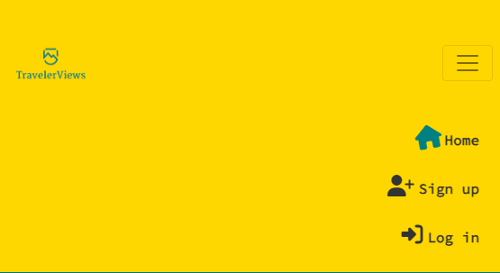

### Second Navigation Bar
- Allows users to create a post
- Allows users the option to see only the photos they have liked
- Allows users the option to see only the posts from users they have followed
- Displayed on most site pages, with the exception of pages related to creating, updating posts, updating profiles, and changing password.
- Users who are not logged in or signed up will be unable to use the navbar. Hovering over the icons will display a small message informing them that they must be logged in to access the respective section.
- User stories covered: 9, 14, 15

See featured screenshots

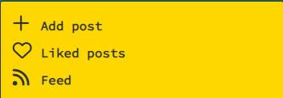
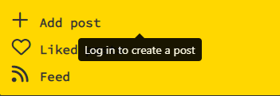
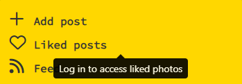
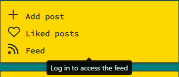

### Sign up form
- New users can create an account to have full access of the site
- User must provide a valid username between 1 and 10 characters long, along with a valid password and password confirmation which must be a minimum of 8 characters long.
- Duplicate usernames are not allowed during the signup process; each username must be unique.
- After successfully signing up, users are automatically redirected to the login page to log in with their newly created credentials.
- User stories covered: 3

See featured screenshot

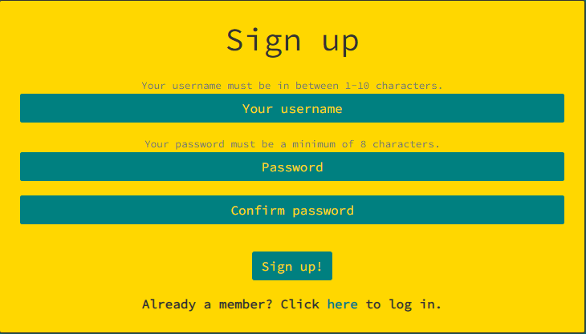

### Login form
- Returning users can login to their account
- The user must have a registered account and must enter the correct credentials.
- In case of incorrect credentials being inputted during the login process, a warning message is displayed to the user.
- User stories covered: 4

See featured screenshot

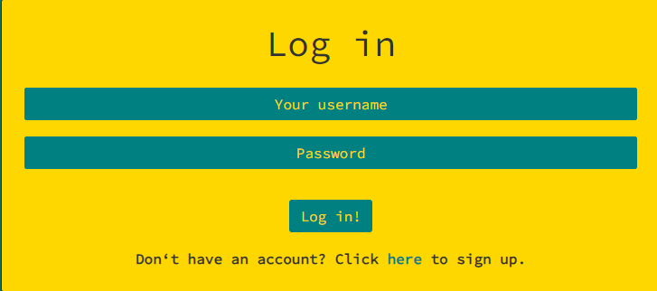

### Post create/update form
- The post creation form includes fields for Title, Description, Country and Image upload
- The description field is optional, giving users flexibility in providing additional details.
- Allows the users to share their photos
- An option is provided for users to specify the country where the photo was taken, enhancing search and filtering capabilities for other users.
- The update form enables users to revisit and modify the details of a post they previously created. This flexibility is particularly useful in case of typos or if the wrong image was uploaded. All fields within the form are editable, providing users with the ability to make necessary adjustments.
- User stories covered: 9, 18

See featured screenshots

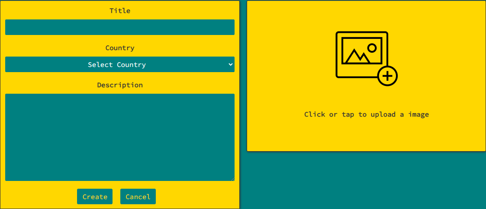
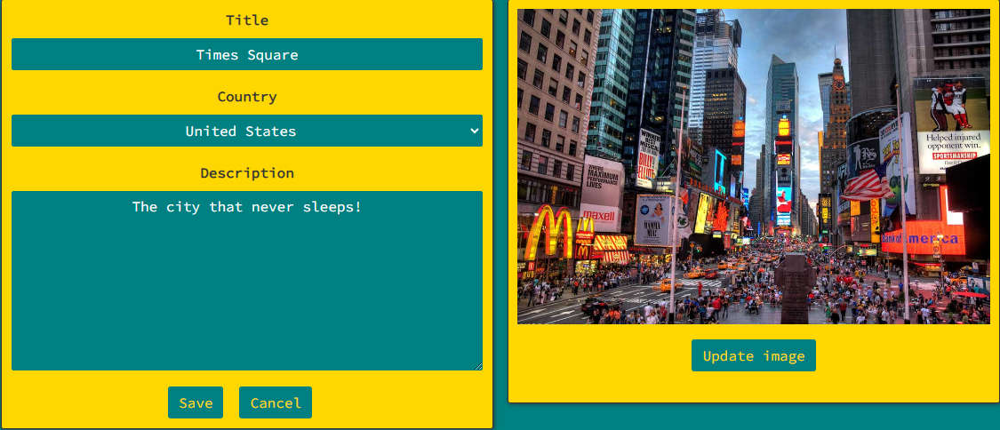

### Posts page
As detailed in the Landing page section above, the posts page serves as the default destination for all users upon entering the site.
- Displays posts in descending order based on how recent they are.
- Features a search bar positioned above the posts for easy content retrieval.
- Includes the secondary navigation bar for enhanced user interaction.
- Displays a section dedicated to top users.
- Includes a section featuring popular countries.
- User stories covered: 12

See featured screenshot

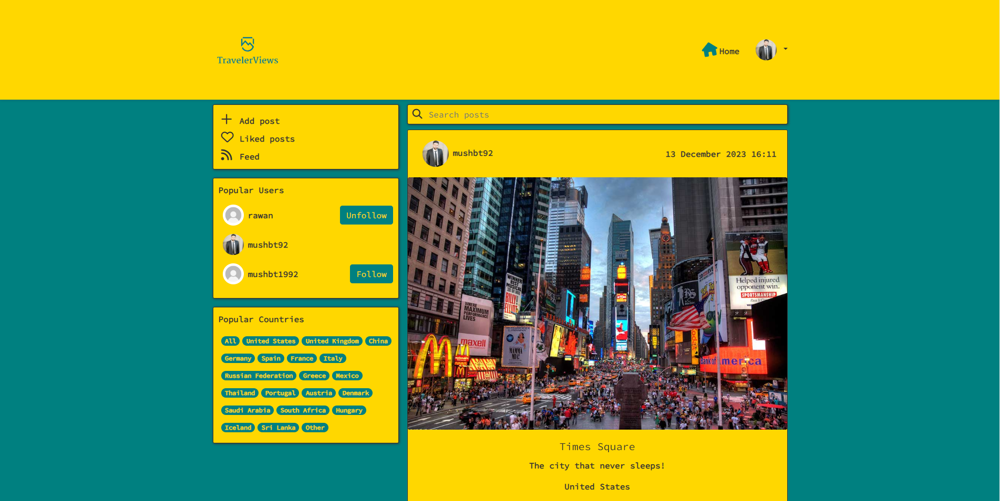

### Post page
- Contains individual post details, including the image, title, optional description, and country tag.
- Displays the count of likes and comments the post has received.
- Includes a like icon for users to express their appreciation for the post.
- Features a comments section below the post for user engagement.
- User stories covered: 10, 17, 21, 

See featured screenshot

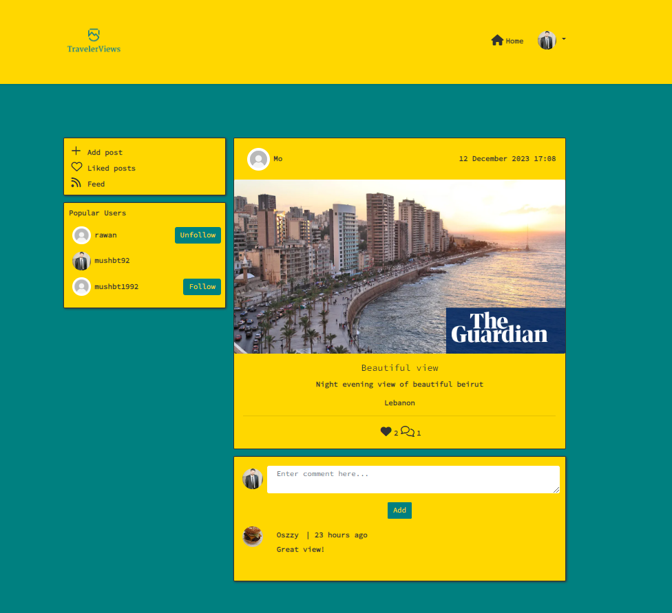

### Comments
- Allows users to express their thought on a post.
- Shows the timestamp indicating how long ago the comment was posted.
- Allows users to edit or delete their own comments in case of errors or changes.
- User stories covered: 19, 20, 21, 22 and 23

See featured screenshots

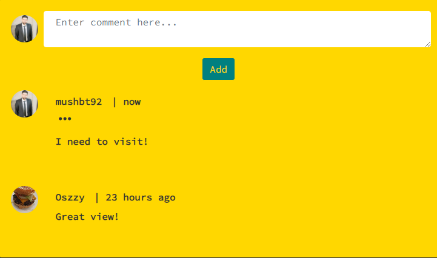
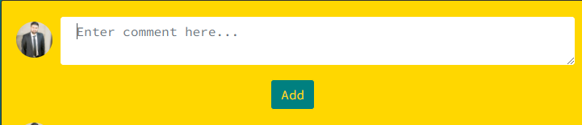
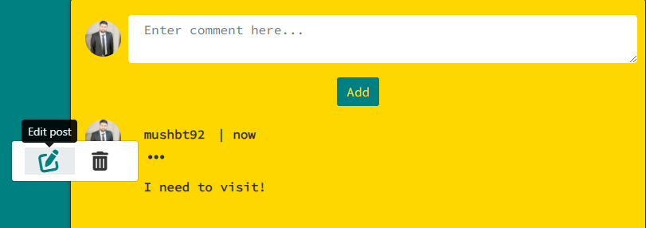
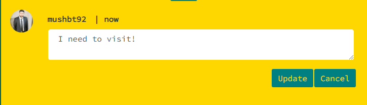
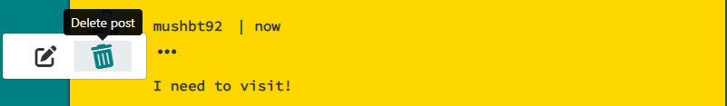

### Likes
- Allows users to express their interest in a post.
- The like icon turns black when a user likes the post.
- Users are restricted from liking their posts.
- Provides users with the option to filter the displayed posts to show only those they have liked.
- User stories covered: 11

See featured screenshots

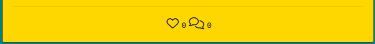

### Profile page
- Contains user name and avatar
- If the user has shared a brief introduction or information about themselves, it will be visible in their profile.
- Displays statistics on the number of posts, followers, and users they are following.
- For users on their profile page, a dropdown menu is displayed, allowing them to edit their profile or change their password.
- User stories covered: 24, 26, 28, 29, 30 and 34

See featured screenshots

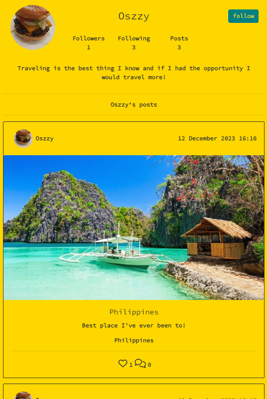
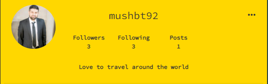
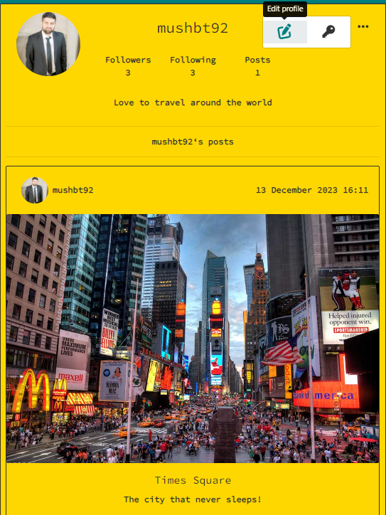
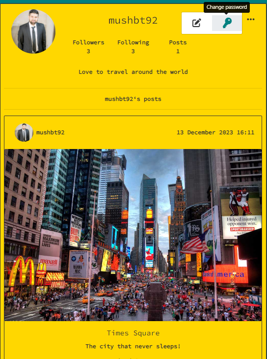

### Profile avatar
The profile avatar is displayed in various sections of the site:
- The Navbar when the user is logged in
- At the top of each post
- On the profile page for every user
- Beside each comment
- Displayed in the 'Popular Profiles' section
- User stories covered: 8

See featured screenshots

### Password change form
- Allows users to change their profile password incase they feel their profile is compromised
- User stories covered: 34

See featured screenshots

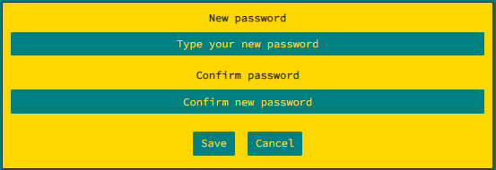

### Infinite scroll
- Allows users to seamlessly scroll through content without the need to load new pages 
- Used for posts and comments
- Enhances user experience and engagement
- During the loading process, a "Loading Spinner" is displayed to provide visual feedback to users.
- User Stories covered: 2 and 16

See featured screenshot

### Follow/unfollow
- Users have the ability to follow other users if they like their content, enabling easy access to their posts via the feed icon in the secondary navbar.
- Should a user change their mind, they can unfollow at any time.
- User stories covered: 15 and 27

See featured screenshots

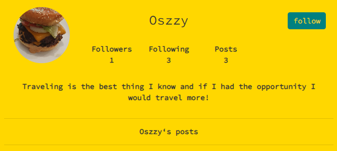
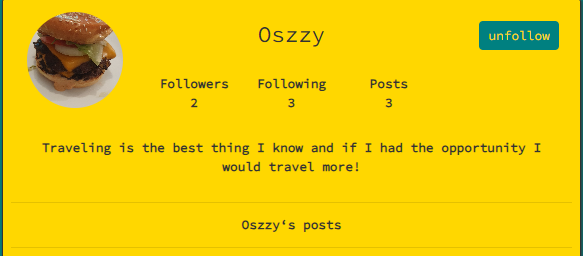

### Popular Users
- Displays the top three most followed users, presenting the most popular profiles in descending order.
- Users can conveniently follow these profiles using dedicated follow buttons.
User stories covered: 25

See featured screenshot

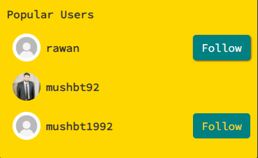

### Popular Countries
- Displays the most popular countries, providing users with the option to filter content based on these countries. (The list of popular countries was created through google searches to identify the most sought-after travel destinations in 2023.)
User stories covered: 13

See featured screenshot

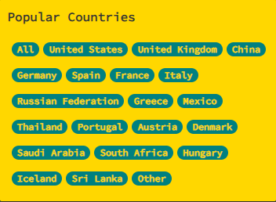

### Search bar
- Allows users to search for posts by entering keywords such as username, country, or title. It enhances the user experience by allowing precise content filtering.
User stories covered: 35

See featured screenshot

### 404 error page
- 404 error page will display if the user enters a URL that does not exist.
- Contains a button which will redirect the user back the posts page.
- User stories covered: 36

See featured screenshot

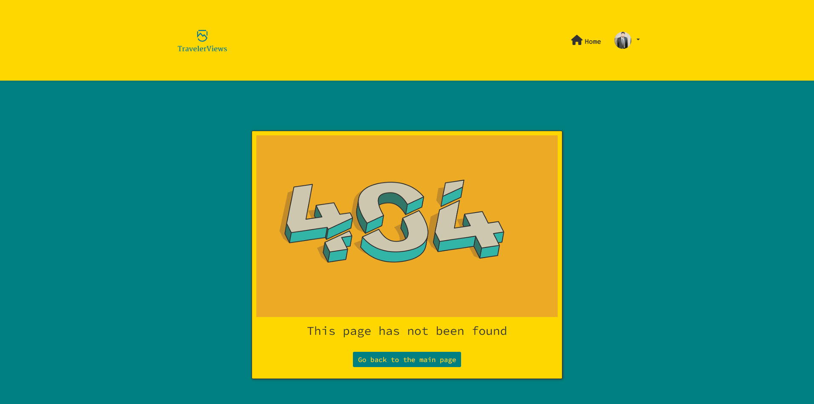

### Feedback messages
- User is provided with feedback messages about certain actions they have tried to perform. There are successful messages and unsuccessful messages which gives the user visual confirmation.
They are as followed:
 - Successful in creating a profile
 - Successful and unsuccessful in updating a profile
 - Successful and unsuccessful in updating password
 - Successful and unsuccessful in creating a post
 - Successful and unsuccessful in updating a post
 - Successful in deleting a post
 - Successful and unsuccessful in creating a comment
 - Successful in updating a comment
 - Successful in deleting a comment

 

See featured screenshots

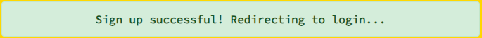
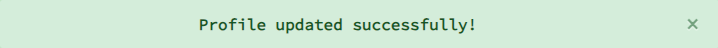
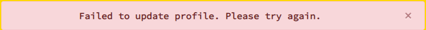
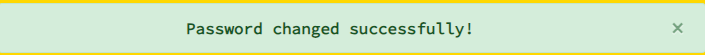
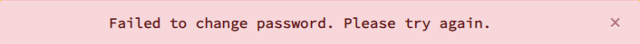
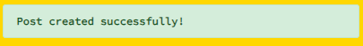
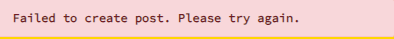
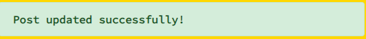
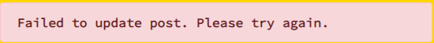
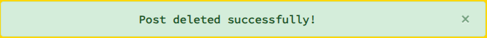

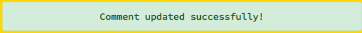
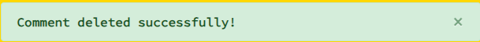

## Future features & Improvements

### Future features
- Email Requirement - Users are prompted to provide an email address during the signup process. This information is vital for the Forgotten Password feature detailed below.
- Forgotten Password Feature - In case users forget their password, this feature allows them to recover access to their account.
- Messaging Feature - Users can engage in direct communication by sending messages to each other, allowing better interactions and communication within the site.
- Grid Layout for User Posts - When viewing a specific user's profile, users can explore their posts presented in a visually appealing grid layout, enhancing the overall user experience.
- Contact Site Admin - Allows users to address any concerns, queries or issues. Users can easily reach out to site admin. This feature ensures a direct line of communaction for user support and assistance.

### Improvements
- Reduced Navbar Height - The height of the Navbars can be minimized to provide a sleeker and more streamlined appearance.
- Larger Site Logo -  Enlarging the site logo enhances its visibility.
- Fixed Secondary Navbar, Popular Profiles, and Popular Countries - Fixing these elements to the page ensures users have constant access, allowing navigation even when scrolling down the page.
- Popular Countries Section - Display countries with the most posts dynamically to provide users with more site-relevant information.
- Spinner Color - Changing the color of the loading spinner for new posts can be enhance visual contrast and improve the overall user experience.
- Exclude User's Own Profile in Popular Users - Ensure that a user's own profile is excluded from the Popular Users section to optimize space and avoid redundancy.

##### Back to [top](#table-of-contents)

## Validation

### HTML
The W3C Markup Validation Service was used to validate the HTML of the website. No errors were identified. 